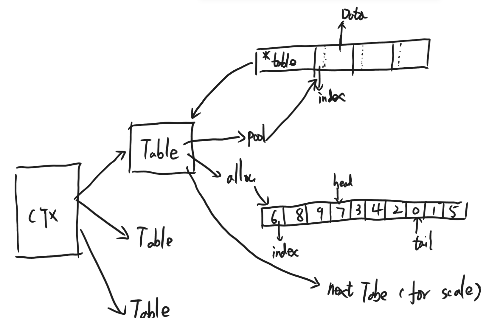

# Bmem
batch memory - 批量内存

# Usage
```c
#include "bmem.h"

int main()
{
    bm_context_t *ctx = bm_context_register(8, 1024, 1024);
    if (ctx == NULL) return -1;
    int *a = bm_malloc(ctx, sizeof(int));
    bm_free_s(a, sizeof(int));

    int *b = bm_malloc(ctx, sizeof(int));
    bm_free(ctx, b);
    bm_context_destroy(ctx);
    return 0;
}
```

# Target
- allocate and release memory with O(1) complexity

# Design


# Roadmap
- [x] add performance test
- [x] support expansion automatically
- [ ] using hash for boosting table query speed
- [ ] support multithread
